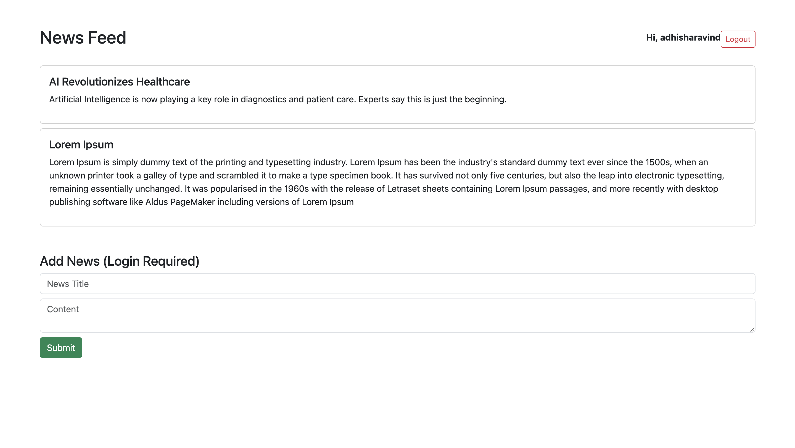
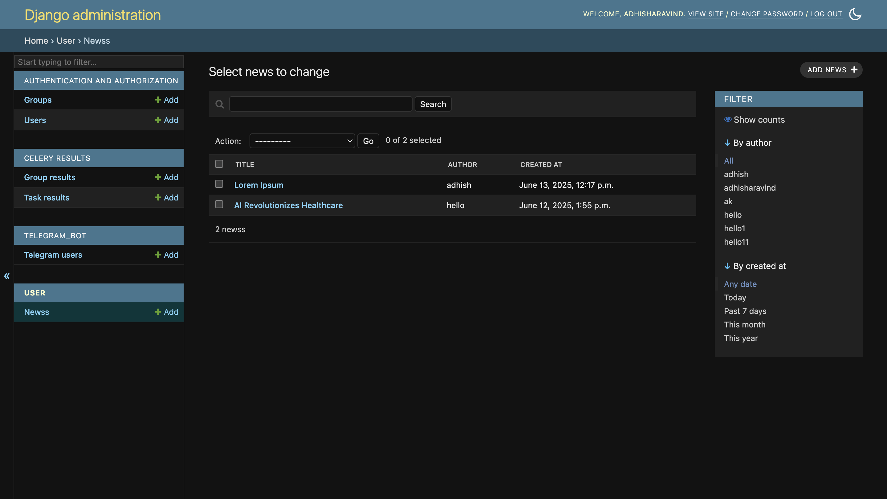

# 🛡️ JWT-and-Telegram-Bot-Assignment

This is a full-stack Django project built as part of an internship assessment. It includes JWT-based authentication, asynchronous email verification via Celery and Redis, a basic news management API, Telegram bot integration, and an HTML-based frontend.

---

## 🚀 Features

- ✅ JWT Authentication (Login, Refresh)
- 📧 Async Email Verification using Celery + Redis
- 📰 News Posting & Viewing API
- 🤖 Telegram Bot Integration (collects user chat IDs)
- 👨‍💻 Admin Panels for News & Telegram Users
- 🌐 Frontend: Homepage, Register, Login

---

## 🛠️ Tech Stack

- **Backend**: Django, Django REST Framework
- **Auth**: JWT (`djangorestframework-simplejwt`)
- **Async**: Celery + Redis
- **Database**: PostgreSQL
- **Bot**: `python-telegram-bot`
- **Frontend**: HTML + JS (basic)
- **Deployment-ready** via `.env` variables

---

## 📂 Project Structure
```
.
├── backend/            # Django project settings
├── user/               # User registration, auth, news, Celery tasks
├── telegram_bot/       # Telegram webhook handler, admin panel
├── frontend/           # Static HTML pages: homepage, login, register
├── requirements.txt    # Python dependencies
├── manage.py
└── dump.rdb            # Redis snapshot
```
---

## 🔐 Environment Variables (`.env`)

```env
SECRET_KEY='your-secret-key'
DEBUG=True

# PostgreSQL
DB_NAME='assignment_db'
DB_USER='postgres'
DB_PASSWORD='your-password'
DB_HOST='localhost'
DB_PORT='5432'

# SMTP for email
EMAIL_HOST_USER='your-email@gmail.com'
EMAIL_HOST_PASSWORD='your-app-password'

```
---

🔑 API Endpoints

🧍 Auth & User

| Method	| Endpoint	| Description |
|---|---|---|
| POST |	/api/token/	| Obtain JWT access and refresh tokens |
| POST |	/api/token/refresh/	| Refresh JWT token |
| POST |	/api/register/	| Register a new user |
| GET	| /api/user/	| Get current user’s username |

📰 News

| Method	| Endpoint	| Description |
|---|---|---|
| GET	| /api/news/	| List all published news |
| POST	| /api/news/	| Create a news post |
| GET	| /api/news/<int:pk>/ |	Retrieve a specific news item |

🤖 Telegram

| Method	| Endpoint	| Description |
|---|---|---|
| POST	| /telegram/webhook/	| Telegram webhook endpoint |


---

⚙️ Admin Panel Access

Admin interface is available at:
```
/admin/
```

✅ Admin panels registered for:

  • Users\
	•	News\
	•	TelegramUser (stores Telegram chat IDs)

---

💻 Screenshots

Add screenshots in a /screenshots folder or embed them here.

Example:






---

🧪 Running the Project Locally
	1.	Clone the Repository:
```
git clone https://github.com/your-username/JWT-and-Telegram-Bot-Assignment.git
cd JWT-and-Telegram-Bot-Assignment
```

  2.	Create and Activate a Virtual Environment:
```
python3 -m venv .venv
source .venv/bin/activate
```

  3.	Install Requirements:
```
pip install -r requirements.txt
```

  4.	Configure PostgreSQL and Create .env File
	5.	Run Migrations:
```
python manage.py migrate
```

  6.	Start Redis Server:
```
redis-server
```

  7.	Start Celery Worker:
```
celery -A backend worker --loglevel=info
```

  8.	Run Django Server:
```
python manage.py runserver
```

---

📡 Telegram Bot Setup using Ngrok

1.	Start ngrok to expose your local server
   ```
    ngrok http 8000
  ```
2. Copy the HTTPS Forwarding URL, e.g.:
```
  https://abcd1234.ngrok.io
  ```
3. Set Webhook for Telegram Bot
```
https://api.telegram.org/bot<YOUR_TOKEN>/setWebhook?url=https://abcd1234.ngrok.io/telegram/webhook/
```

Once done, the bot will capture chat IDs from users who send /start.

---

🧠 Notes
	•	Only authenticated users can post news.
	•	Anyone (unauthenticated) can read published news.
	•	Celery + Redis handles email asynchronously after registration.
	•	Telegram webhook works well with tools like ngrok during local testing.

---

🪪 License

This project was developed as part of an internship assignment. All rights reserved by the author.

---

✍️ Author

Adhish Aravind
GitHub Profile

